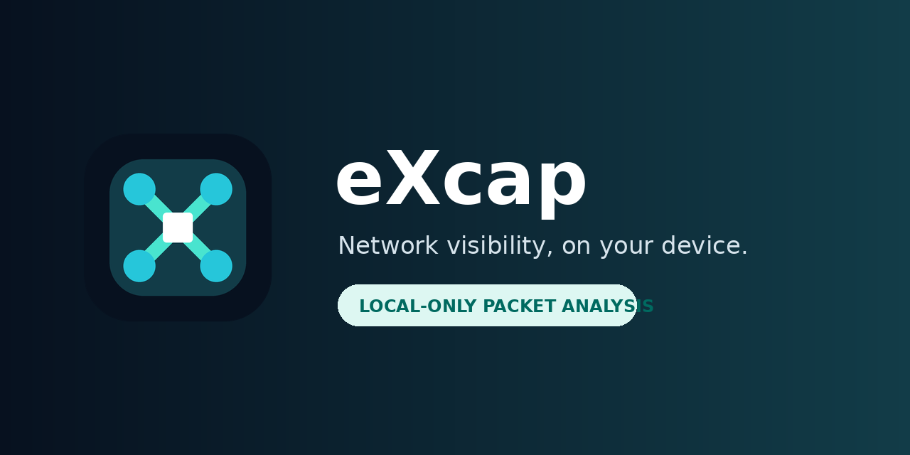

<p align="center">
  
</p>

# eXcap

**eXcap is a professional, no-root Android network diagnostics app.** It creates a local Android VPN interface, attributes connections to installed apps, reconstructs network flows, and keeps packet processing on the device.

> **Use eXcap only on devices, apps, and traffic you own or are explicitly authorized to inspect.** eXcap is designed for debugging, QA, education, incident response, and privacy auditing—not covert monitoring.

## What it can inspect

| Capability | What eXcap shows |
|---|---|
| **Per-app capture** | Capture one selected app, a selected group, or the full device |
| **TCP/UDP flows** | Source/destination addresses, ports, protocol, status, timing, direction, and byte counts |
| **DNS** | Queries, resolved addresses, and app attribution |
| **Plaintext HTTP** | Request method, host, URL, headers, status, response metadata, and payload views |
| **HTTPS/TLS metadata** | Remote endpoint, port, SNI/server name when available, TLS metadata, timing, and encrypted byte counts |
| **Raw payload** | Text and hexadecimal views for payload bytes visible to the capture engine |
| **Exports** | PCAP, PCAPNG, CSV, and HAR for Wireshark or other analysis tools |
| **Live analysis** | Connection list, app statistics, hosts, countries, protocols, and real-time traffic totals |
| **Advanced routing** | Optional SOCKS5, remote collector, UDP exporter, and root-interface capture modes |

### Important HTTPS limitation

Normal HTTPS content is encrypted end-to-end. eXcap **does not bypass TLS** and cannot display encrypted request or response bodies by default. It can still show connection metadata such as the target IP, port, app, SNI when observable, timing, and volume.

An optional compatibility path exists for the separate upstream TLS add-on and a user-installed CA. It requires explicit setup, may not work with certificate-pinned apps, and must only be used with authorization. It is not enabled by default.

## Product principles

- **Local first:** capture parsing occurs on the Android device.
- **Explicit consent:** Android displays its standard VPN authorization prompt.
- **Visible operation:** an ongoing notification is shown while capture is active.
- **No root required:** the standard engine uses Android `VpnService`.
- **No credential harvesting:** eXcap does not provide automation for extracting passwords, tokens, or private keys.
- **User-controlled export:** data leaves the app only through an explicitly selected export, collector, or forwarding feature.

## Capture workflow

1. Open **eXcap** and choose a dump mode.
2. Enable **Target apps** and select one app for focused inspection, or leave it off for device-wide capture.
3. Tap the status ring or **Start**.
4. Approve Android's local VPN prompt.
5. Use the selected app to generate traffic.
6. Open **Connections** to inspect its TCP/UDP flows and HTTP/TLS metadata.
7. Stop the capture and export PCAP/PCAPNG, CSV, or HAR when needed.

## Architecture

```text
Selected Android apps
        │
        ▼
Android VpnService / optional root interface
        │
        ▼
Native capture engine (zdtun + nDPI)
        │
        ├── flow reconstruction and app/UID attribution
        ├── DNS, HTTP, TLS/SNI and protocol metadata
        ├── connection and payload model
        └── PCAP/PCAPNG/CSV/HAR exporters
        │
        ▼
Java + Material Components user interface
```

See [`docs/ARCHITECTURE.md`](docs/ARCHITECTURE.md) for data flow, trust boundaries, and implementation details.

## Build locally

### Requirements

- Linux, macOS, or Windows
- **JDK 21**
- Android SDK with:
  - `platforms;android-37.0`
  - `build-tools;37.0.0`
  - `ndk;28.2.13676358`
  - `cmake;3.22.1`
- Git submodules initialized

### Commands

```bash
git clone --recurse-submodules https://github.com/gptind826-dotcom/eXcap-Android.git
cd eXcap-Android
./gradlew testStandardDebugUnitTest lintStandardDebug
./gradlew assembleStandardDebug
```

The installable debug APK is produced at:

```text
app/build/outputs/apk/standard/debug/app-standard-debug.apk
```

The debug APK is signed with Android's generated debug key and is suitable for testing. Production distribution should use a protected release keystore configured outside the repository.

## GitHub Actions APK

`.github/workflows/debug-build.yml` runs on pushes, pull requests, tags, and manual dispatches. It:

1. checks out all native submodules;
2. installs JDK 21 and the pinned Android/NDK toolchain;
3. runs unit tests and Android lint;
4. builds `assembleStandardDebug`;
5. generates a SHA-256 checksum; and
6. uploads the APK, checksum, lint report, and test report as a workflow artifact.

A tag such as `v1.0.0` also creates a GitHub Release containing the verified debug APK. For public production releases, replace debug signing with a repository/environment secret-backed release-signing job.

## Testing

The project includes upstream unit tests for packet, connection, filtering, HTTP, DNS, IP, decryption-list, and utility behavior. The validation run for this eXcap build is documented in [`docs/TESTING.md`](docs/TESTING.md).

## Privacy and security

- Read [`PRIVACY.md`](PRIVACY.md) before using captures containing personal data.
- Report vulnerabilities using [`SECURITY.md`](SECURITY.md).
- Capture files can contain sensitive URLs, headers, DNS names, and plaintext payloads. Store and share them carefully.
- eXcap's own application ID is `app.excap.network` (`app.excap.network.debug` for debug builds).

## License and attribution

This project is a modified distribution of [PCAPdroid](https://github.com/emanuele-f/PCAPdroid), originally created by **Emanuele Faranda** and contributors. The proven capture engine is reused under **GNU GPL v3 or later**. Upstream copyright, source headers, submodule history, and license notices are intentionally preserved.

The eXcap name, network-node logo, product copy, package identity, dashboard, color system, privacy documentation, and CI packaging are project modifications. See [`NOTICE`](NOTICE) and [`COPYING`](COPYING).
